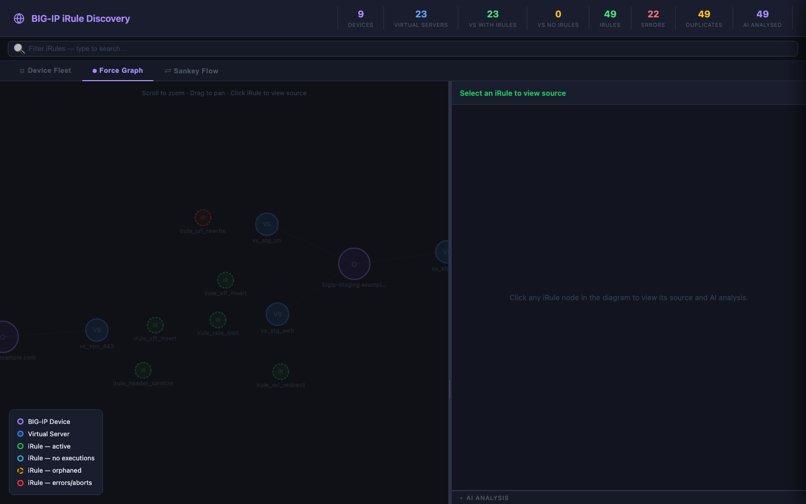
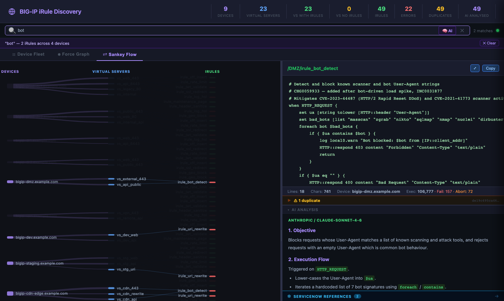

# BIG-IP iRule Discovery

A Python CLI tool that connects to one or more F5 BIG-IP devices, discovers every iRule attached to a virtual server, saves the source as `.tcl` files, and generates a fully self-contained HTML viewer with interactive diagrams, execution statistics, AI-powered code analysis, and ServiceNow/CVE integration.

---

## Quick Start

```bash
git clone https://github.com/snowblind-/iRuleDiscovery.git
cd iRuleDiscovery
pip install -r requirements.txt

# Generate the demo (no BIG-IP required)
python3 generate_demo.py
open irule_output/irule_viewer.html
```

Copy `.env.template` to `.env` and add your AI provider credentials before running against real devices.

---

## Features

- **Device Fleet** — compact status-tile grid; colour-coded by worst-case iRule health; click any tile to jump to that device in the Force Graph
- **Force Graph** — D3.js force-directed graph linking devices → virtual servers → iRules; search/filter dims non-matching nodes
- **Sankey Flow** — left-to-right flow diagram showing device → VS → iRule relationships; filter highlights matching paths
- **Universal search & filter** — type anywhere to instantly filter all three views simultaneously
- **Execution stats & sparklines** — per-iRule execution, failure, and abort counters polled from BIG-IP and stored in SQLite; hover any iRule node to see a one-week sparkline
- **iRule status flags** — automatically classified per run:
  - 🔴 **Error** — failures or aborts recorded
  - 🟡 **Orphan** — exists on BIG-IP but not attached to any virtual server
  - 🟢 **Active** — attached with recorded executions
  - 🔵 **Attached** — attached but no executions yet
- **AI code analysis** — structured review (Objective / Execution Flow / Recommendations) targeting TCL/BIG-IP improvements only. Supports **Anthropic Claude**, **OpenAI**, and **F5 Distributed Cloud AI**. Results cached by content hash — unchanged iRules are never re-submitted
- **ServiceNow integration** — scans every iRule for ticket references (INC, CHG, RITM, PRB, TASK, SCTASK…); displays in a slide-in flyout panel. Demo data includes realistic synthetic ticket references linked to the iRule source comments
- **CVE hyperlinks** — any CVE number found in ticket context is auto-linked to the NVD public database
- **Local RAG query** — `irule_rag.py` builds a semantic embedding index; ask natural-language questions about your iRules and get LLM-grounded answers referencing the actual code
- **Duplicate detection** — iRules with identical source across devices are flagged and cross-linked
- **Incremental runs** — content-hashed; only changed iRules trigger re-discovery or re-analysis
- **XC iRule library upload** — optionally push discovered iRules to the F5 Distributed Cloud iRule library (Phase 3)

---

## Screenshots

### Device Fleet — default landing view
Status tile grid. Each device is coloured by its worst-case iRule health. Click any tile to navigate directly to that device in the Force Graph.


### Universal Search & Filter
Type in the search bar to instantly filter all three views. The banner shows matched iRule count and device count.


### Force Graph
D3.js force-directed graph linking devices → virtual servers → iRules. Drag nodes, scroll to zoom, click any iRule to open its source panel.


### Force Graph — selected device
Clicking a device node highlights its virtual servers and all attached iRules; everything else is dimmed.



### Force Graph — filtered view
Text filter applied — non-matching nodes are dimmed; matching iRules are highlighted across the whole graph.


### iRule Source & AI Analysis
Click any iRule node to open its TCL source. The AI Analysis panel shows a structured review. The **ServiceNow References** divider below opens the flyout when clicked.


### ServiceNow References flyout
Slides in from the right when an iRule has ticket references. Each card shows the ticket type badge, LLM summary, and original code context. CVE numbers are auto-linked to NVD.


### ServiceNow panel detail
Full panel view showing multiple ticket types (INC, CHG, RITM, PRB) with context snippets and CVE hyperlinks.


### Sankey Flow
Left-to-right dependency diagram. Useful for identifying widely-shared iRules and tracing VS dependencies.


### Sankey Flow — filtered
Filter applied — non-matching flows are dimmed while matching paths stay highlighted.



---

## Installation

```bash
pip install -r requirements.txt
```

Core discovery and viewer generation have **no third-party runtime dependencies** beyond `requests`. The packages in `requirements.txt` cover the optional RAG features in `irule_rag.py`.

---

## Discovering Real BIG-IP Devices

```bash
# Single device
python3 irule_discovery.py --host 10.1.1.1 -u admin -p secret

# Multiple devices from a file
python3 irule_discovery.py --hosts-file devices.txt -u admin -p secret

# Include iRules not attached to any VS (excludes _sys_* built-ins)
python3 irule_discovery.py --host 10.1.1.1 -u admin -p secret --include-orphans

# Refresh execution stats only (no full re-discovery)
python3 irule_discovery.py --host 10.1.1.1 -u admin -p secret --stats-only

# Re-generate the viewer from an existing manifest (no BIG-IP needed)
python3 irule_discovery.py --rebuild-html
```

---

## AI Analysis

Configure your provider in `.env` (copy from `.env.template`):

```ini
# Anthropic Claude (default model: claude-sonnet-4-6)
ANTHROPIC_API_KEY=sk-ant-...
AI_PROVIDER=anthropic
AI_MODEL=claude-sonnet-4-6

# OpenAI (default model: gpt-4o)
OPENAI_API_KEY=sk-...
AI_PROVIDER=openai
AI_MODEL=gpt-4o

# F5 Distributed Cloud AI
F5_XC_API_KEY=your_token
AI_PROVIDER=xc
```

Run AI analysis on existing data without re-discovering:

```bash
python3 irule_discovery.py --rebuild-html --ai-provider anthropic
python3 irule_discovery.py --rebuild-html --ai-provider xc --tenant mycompany
```

Force re-analysis after changing providers or clearing stale cache:

```bash
sqlite3 irule_output/irule_discovery.db "DELETE FROM ai_cache;"
python3 irule_discovery.py --rebuild-html --ai-provider anthropic
```

Analysis covers: objective, execution flow, and BIG-IP/TCL-specific recommendations (logic, performance, security, resilience). It **does not** recommend migrating to other platforms.

---

## ServiceNow Integration

`irule_rag.py` scans iRule source and comments for ticket references and generates LLM summaries:

```bash
# Scan all iRules for ServiceNow ticket references + LLM summaries
python3 irule_rag.py --scan-snow

# Fast scan — regex only, no LLM
python3 irule_rag.py --scan-snow --no-llm

# Rebuild the viewer to include latest ServiceNow data
python3 irule_rag.py --rebuild-html

# Print all cached ServiceNow references
python3 irule_rag.py --show-snow
```

The demo (`generate_demo.py`) seeds the `servicenow_refs` table directly with synthetic ticket data matching the comments in each demo iRule, so the ServiceNow flyout works out of the box with no external scanning required.

To make ticket numbers clickable, set `SNOW_INSTANCE_URL` in the generated HTML or in `irule_discovery.py`:

```javascript
const SNOW_INSTANCE_URL = 'https://yourcompany.service-now.com';
```

---

## Local RAG Query

Requires Ollama with `llama3` and `nomic-embed-text`. Build the index first, then ask anything about your iRule fleet:

```bash
# Build semantic embedding index
python3 irule_rag.py --build-index

# Ask natural-language questions — answers are grounded in your actual iRule code
python3 irule_rag.py --query "which iRules perform rate limiting?"
python3 irule_rag.py --query "which iRules solve a CVE?"
python3 irule_rag.py --query "does CVE-2022-23852 apply to version 17.1.3 of BIG-IP TMOS?"
python3 irule_rag.py --query "does CVE-2022-23852 have a WAF signature that could replace the iRule?"
```

Example output for the CVE queries:

```
$ python3 irule_rag.py --query "which iRules solve a CVE"
Embedding question against 10 indexed iRules …

Top 5 most relevant iRules:
  1. /Common/irule_maintenance_page  (similarity 0.543)
  2. /Common/irule_jwt_validate      (similarity 0.514)
  3. /Common/irule_geo_block         (similarity 0.510)
  4. /DMZ/irule_bot_detect           (similarity 0.497)
  5. /Prod/irule_header_sanitize     (similarity 0.490)

────────────────────────────────────────────────────────────
Based on the provided context, the following iRules address CVEs:

1. /Common/irule_jwt_validate — addresses CVE-2022-23852, a vulnerability
   related to improper validation of JSON Web Tokens on BIG-IP ADC.
2. /Prod/irule_header_sanitize — addresses CVE-2019-16745, a vulnerability
   related to HTTP header injection on BIG-IP ADC.
```

```
$ python3 irule_rag.py --query "does CVE-2022-23852 apply to version 17.1.3 of BIG-IP TMOS"
Embedding question against 10 indexed iRules …

Top 5 most relevant iRules:
  1. /DMZ/irule_bot_detect           (similarity 0.526)
  2. /Common/irule_jwt_validate      (similarity 0.524)
  3. /Prod/irule_header_sanitize     (similarity 0.522)
  4. /Common/irule_log_hsl           (similarity 0.502)
  5. /Common/irule_maintenance_page  (similarity 0.498)

────────────────────────────────────────────────────────────
According to the F5 K4604 security advisory, CVE-2022-23852 affects versions
16.0.0 – 17.1.5 of BIG-IP software, including 17.1.3.

To mitigate this vulnerability on version 17.1.3, apply the latest security
patches and consider disabling HTTP/2 support if not required.
```

```
$ python3 irule_rag.py --query "does CVE-2022-23852 have a WAF signature that could replace the iRule"
Embedding question against 10 indexed iRules …

Top 5 most relevant iRules:
  1. /Common/irule_jwt_validate      (similarity 0.566)
  2. /Prod/irule_header_sanitize     (similarity 0.561)
  3. /Common/irule_maintenance_page  (similarity 0.561)
  4. /Common/irule_log_hsl           (similarity 0.540)
  5. /Common/irule_xff_insert        (similarity 0.535)

────────────────────────────────────────────────────────────
CVE-2022-23852 was patched by F5 in January 2022. To replace the iRule with a
dedicated WAF signature, use the following in BIG-IP ASM:

  Signature ID:   2000011
  Signature Name: CVE-2022-23852 - JWT Token Bypass

This signature detects and blocks attempts to bypass JWT token validation.
Using a dedicated WAF signature for this specific vulnerability provides better
protection and detection than an iRule alone.
```

---

## Output Files

| File | Description |
|---|---|
| `irule_output/irule_viewer.html` | Self-contained interactive viewer (no external dependencies at runtime) |
| `irule_output/manifest.json` | Full discovery manifest |
| `irule_output/irules/*.tcl` | Raw iRule source files |
| `irule_output/irule_discovery.db` | SQLite — AI cache, execution stats, SNow refs, upload registry |

### SQLite tables

| Table | Contents |
|---|---|
| `ai_cache` | AI analysis results keyed by `content_hash::provider::model` |
| `irule_stats` | Time-series execution stats — one row per poll per iRule |
| `servicenow_refs` | Ticket references — ticket number, type, context snippet, LLM summary |
| `upload_registry` | XC library upload tracking per content hash |
| `irule_embeddings` | Semantic embedding vectors for RAG search (populated by `irule_rag.py`) |

---

## Requirements

- Python 3.10+
- Network access to BIG-IP iControl REST API (port 443) for live device discovery

```
requests>=2.31.0
ollama>=0.6.0        # irule_rag.py only
chromadb>=1.5.0      # irule_rag.py only
playwright>=1.58.0   # screenshot generation only
```

---

## License

MIT
