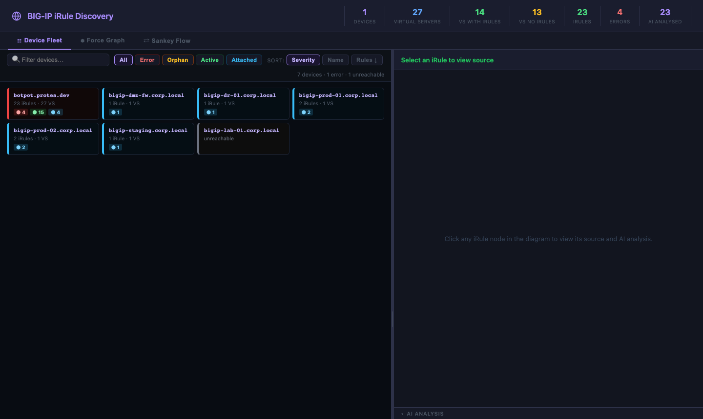
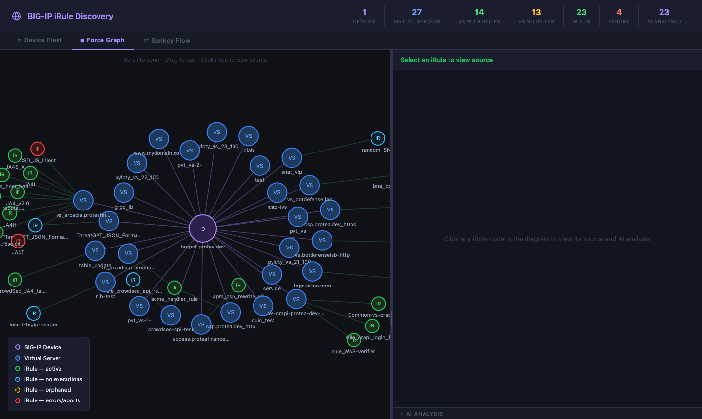
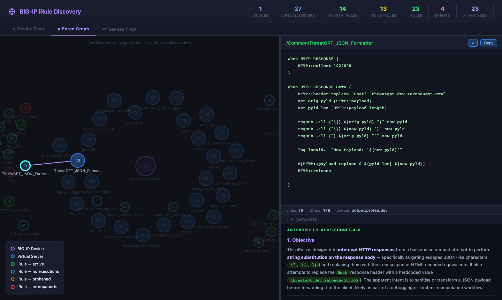
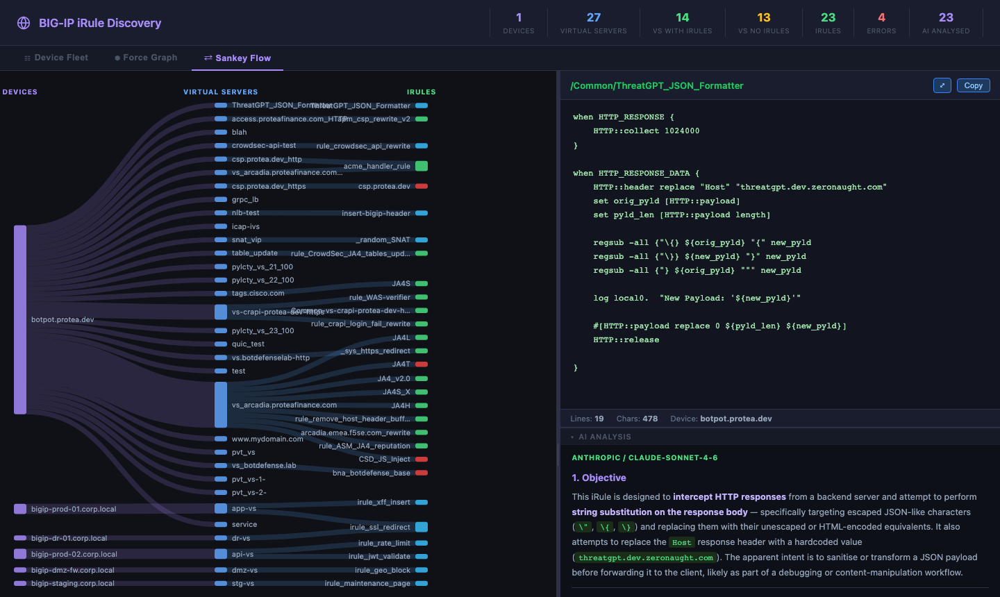

# BIG-IP iRule Discovery

A Python CLI tool that connects to one or more F5 BIG-IP devices, discovers every iRule attached to a virtual server, saves the source as `.tcl` files, and generates a fully self-contained HTML viewer with interactive diagrams, execution statistics, and AI-powered code analysis.

---

## Features

- **Multi-device discovery** — poll any number of BIG-IP hosts in a single run
- **Self-contained HTML viewer** — one portable file with no external dependencies at runtime
- **Device Fleet view** — compact tile grid showing rolled-up health status across all devices, scales cleanly to 1 000+ hosts
- **Force Graph** — D3.js force-directed graph linking devices → virtual servers → iRules; click any node to view source and stats
- **Sankey Flow diagram** — flow diagram showing which virtual servers consume which iRules
- **Execution statistics** — per-iRule execution, failure, and abort counters collected from BIG-IP on every run and stored in SQLite; hover over a node to see a sparkline of execution rate over time
- **iRule status flags** — each iRule is automatically classified:
  - 🔴 **Error** — one or more failures or aborts recorded
  - 🟡 **Orphan** — exists on BIG-IP but not attached to any virtual server
  - 🟢 **Active** — attached and has recorded executions
  - 🔵 **Attached** — attached but no executions yet
- **AI code analysis** — submits each iRule to an AI assistant for objective, function-focused review covering logic correctness, TCL best practices, performance, security, and resilience. Supports Anthropic Claude, OpenAI, and F5 Distributed Cloud AI endpoints. Results are cached by content hash so unchanged iRules are never re-analysed
- **Duplicate detection** — iRules with identical source are linked in the viewer
- **Incremental runs** — only new or changed iRules trigger discovery; unchanged files and analyses are skipped
- **Optional orphan discovery** — `--include-orphans` adds iRules that exist on the device but are not attached to any VS (system built-ins are excluded automatically)

---

## Screenshots

### Device Fleet
The landing view. Every BIG-IP host is represented as a tile coloured by its rolled-up iRule status. Filter by status, search by hostname, or sort by severity, name, or rule count. Click any tile to jump to that device in the Force Graph.



### Force Graph
Interactive D3 force-directed graph. Devices (purple), virtual servers (teal), and iRules (green/yellow/red/blue by status) are linked by their configuration relationships. Scroll to zoom, drag to pan, click an iRule node to open its source in the right-hand panel.



### iRule Source & AI Analysis
Clicking an iRule node opens its TCL source code. If AI analysis has been run, the panel below shows a structured review covering objective, execution flow, and actionable recommendations for improving the iRule as BIG-IP TCL code.



### Sankey Flow
Flow diagram mapping devices → virtual servers → iRules. Node width is proportional to the number of connections. Useful for identifying heavily shared iRules and VS dependency structure.



---

## Quick Start

```bash
# Clone and install dependencies (stdlib only — no pip install required)
git clone https://github.com/snowblind-/iRuleDiscovery.git
cd iRuleDiscovery
cp .env.template .env          # fill in credentials (see Configuration)

# Discover iRules from a single BIG-IP
python3 irule_discovery.py --host 10.1.1.1 -u admin -p secret

# Multiple devices from a file
python3 irule_discovery.py --hosts-file devices.txt -u admin -p secret

# Open the viewer
open irule_output/irule_viewer.html
```

### Generate the demo viewer (no BIG-IP required)

```bash
python3 generate_demo.py
open irule_output/irule_viewer.html
```

---

## Configuration

Copy `.env.template` to `.env` and fill in your values. The `.env` file is git-ignored.

```ini
# Anthropic Claude (recommended)
ANTHROPIC_API_KEY=sk-ant-...
AI_PROVIDER=anthropic
AI_MODEL=claude-sonnet-4-6

# OpenAI
OPENAI_API_KEY=sk-...
AI_PROVIDER=openai
AI_MODEL=gpt-4o

# F5 Distributed Cloud AI
F5_XC_API_KEY=your_token
AI_PROVIDER=xc
```

Credentials can also be passed directly as CLI flags — run `python3 irule_discovery.py --help` for the full list.

---

## CLI Reference

```
python3 irule_discovery.py [OPTIONS]

Source (mutually exclusive):
  --host HOST           Single BIG-IP hostname or IP
  --hosts-file FILE     Text file, one host per line (# comments ok)

Authentication:
  -u, --username        BIG-IP username
  -p, --password        BIG-IP password

Discovery options:
  --partition NAME      Limit to one partition (default: all)
  --include-orphans     Also discover iRules not attached to any VS
  --stats-only          Refresh execution stats only, no re-discovery

AI analysis:
  --ai-provider         xc | anthropic | openai  (env: AI_PROVIDER)
  --ai-model            Model name override       (env: AI_MODEL)
  --ai-key              API key                   (env: AI_API_KEY)

Output:
  -o, --output-dir      Output directory (default: irule_output)
  --no-html             Skip viewer generation
  --rebuild-html        Re-generate viewer from existing manifest (no BIG-IP needed)

Utility:
  --stats-only          Poll execution stats without full re-discovery
  --debug               Enable debug logging
```

---

## Output

| File | Description |
|------|-------------|
| `irule_output/irule_viewer.html` | Self-contained interactive viewer |
| `irule_output/manifest.json` | Full discovery manifest (JSON) |
| `irule_output/*.tcl` | Raw iRule source files |
| `irule_output/irule_discovery.db` | SQLite database — upload registry, AI cache, stats history |

### SQLite tables

| Table | Contents |
|-------|----------|
| `upload_registry` | One row per unique iRule content hash — tracks XC library uploads |
| `ai_cache` | AI analysis results keyed by `content_hash::provider::model` |
| `irule_stats` | Time-series execution stats — one row per poll per iRule |

To force re-analysis of all iRules (e.g. after updating the AI prompt):
```bash
sqlite3 irule_output/irule_discovery.db "DELETE FROM ai_cache;"
```

---

## AI Analysis

The AI analysis is purely advisory — it reviews each iRule **as BIG-IP TCL code** and produces three sections:

1. **Objective** — what the iRule does
2. **Execution Flow** — which events fire, in what order, and what each step does
3. **Recommendations** — specific, actionable suggestions for logic correctness, TCL best practices, performance, security, and resilience

Analysis results are cached by SHA-256 content hash. An iRule that has not changed since the last run will never be re-submitted to the AI, regardless of how many times the tool is run.

---

## Requirements

- Python 3.10+
- Network access to BIG-IP iControl REST API (port 443)
- An API key for at least one AI provider (optional — discovery and viewer work without AI)

No third-party Python packages are required for discovery or viewer generation. The `generate_demo.py` script and screenshot tooling use `playwright` if installed.

---

## License

MIT
