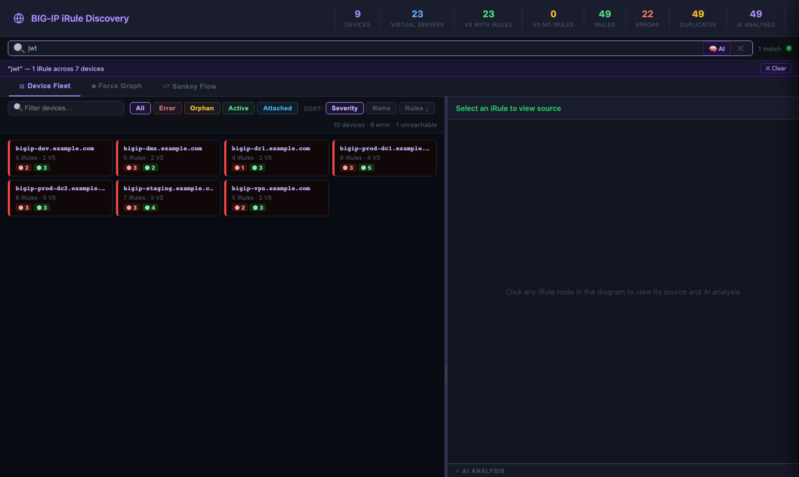
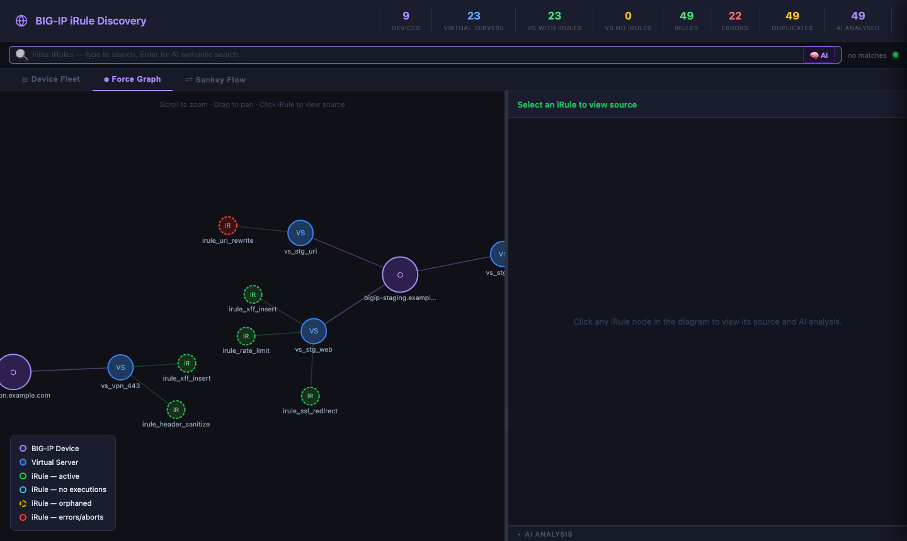
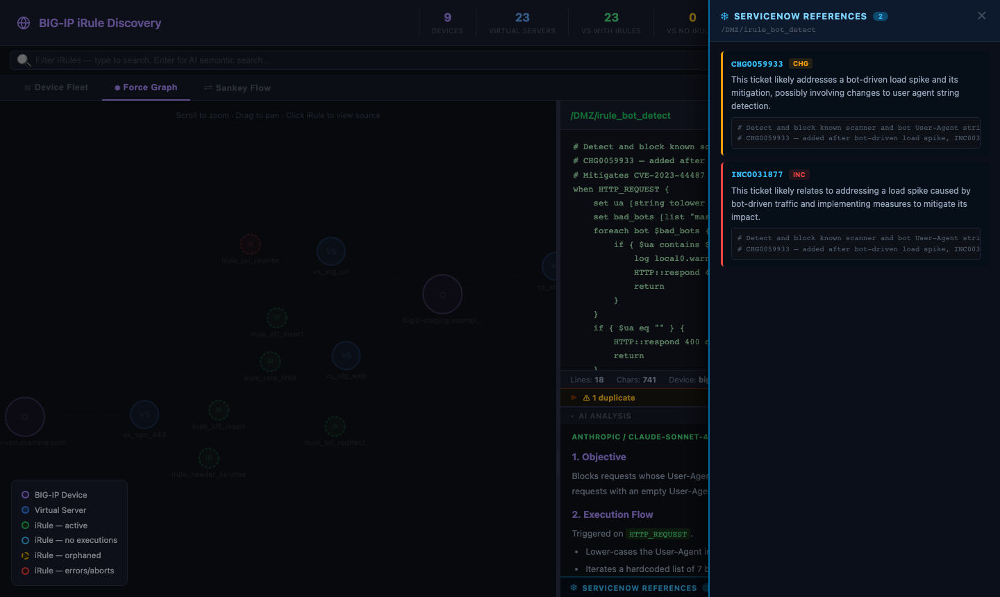

# BIG-IP iRule Discovery

A Python CLI tool that connects to one or more F5 BIG-IP devices, discovers every iRule attached to a virtual server, saves the source as `.tcl` files, and generates a fully self-contained HTML viewer with interactive diagrams, execution statistics, AI-powered code analysis, and ServiceNow/CVE integration.

---

## Quick Install

```bash
git clone https://github.com/snowblind-/iRuleDiscovery.git
cd iRuleDiscovery
bash install.sh          # installs all dependencies, pulls Ollama models, generates demo
```

The install script handles Python packages, Ollama, model downloads, and demo generation automatically.

---

## Features

- **Universal search & filter** — type anywhere to instantly filter all three views simultaneously; press Enter for AI semantic search via local Ollama
- **Device Fleet** — compact status-tile grid scaled to 1 000+ hosts; colour-coded by worst-case iRule health; click any tile to jump to that device in the Force Graph
- **Force Graph** — D3.js force-directed graph linking devices → virtual servers → iRules; search/filter dims non-matching nodes across the whole graph
- **Sankey Flow** — left-to-right flow diagram showing device → VS → iRule relationships; filter highlights matching paths
- **Execution stats & sparklines** — per-iRule execution, failure, and abort counters polled from BIG-IP and stored in SQLite; hover any iRule node to see a one-week sparkline of execution rate
- **iRule status flags** — automatically classified per run:
  - 🔴 **Error** — failures or aborts recorded
  - 🟡 **Orphan** — on BIG-IP but not attached to any virtual server
  - 🟢 **Active** — attached with recorded executions
  - 🔵 **Attached** — attached but no executions yet
- **AI code analysis** — structured review (Objective / Execution Flow / Recommendations) targeting TCL/BIG-IP improvements only. Supports Anthropic Claude, OpenAI, and F5 XC AI. Cached by content hash; unchanged iRules are never re-submitted
- **Local RAG query** — `irule_rag.py` builds a semantic embedding index using Ollama + nomic-embed-text; ask natural-language questions about your iRules from the search bar
- **ServiceNow integration** — scans every iRule for ticket references (INC, CHG, RITM, PRB, TASK, SCTASK…), generates an LLM summary per ticket, displays in a slide-in flyout panel below AI Analysis
- **CVE hyperlinks** — any CVE number found in ticket context is auto-linked to the NVD public database (`nvd.nist.gov`)
- **Duplicate detection** — iRules with identical source across devices are flagged and linked; collapsed by default, expand on click
- **Incremental runs** — content-hashed; only changed iRules trigger re-discovery or re-analysis

---

## Screenshots

### Device Fleet — default landing view
Status tile grid. Each device is coloured by its worst-case iRule health. Click any tile to navigate directly to that device in the Force Graph.


### Universal Search & Filter
Type in the search bar to instantly filter all three views. The banner shows matched iRule count and device count. Switch tabs — the filter persists across Fleet, Force Graph, and Sankey.



### Force Graph — filtered view
Non-matching devices and iRules are dimmed; matching iRules are highlighted. The entire graph remains navigable so you can see context around your results.



### iRule Source & AI Analysis
Click any iRule node to open its TCL source. The AI Analysis panel shows a structured review. The **ServiceNow References** divider below it opens the flyout when clicked.


### ServiceNow References flyout
Slides in from the right when any iRule has ticket references. Each card shows the ticket type badge, Llama 3-generated summary, and original code context. CVE numbers in the context are auto-linked to NVD.



### Sankey Flow
Left-to-right dependency diagram. Useful for identifying widely-shared iRules and tracing which VSes depend on which rules. Filter applies here too — non-matching flows are dimmed.


---

## Installation

### Automated (recommended)

```bash
bash install.sh
```

The script:
1. Checks Python ≥ 3.10
2. Installs Python packages (`pip install -r requirements.txt`)
3. Installs [Ollama](https://ollama.com) if not present
4. Starts `ollama serve` and waits for readiness
5. Pulls `llama3` (generation) and `nomic-embed-text` (embeddings)
6. Installs Playwright Chromium (used for screenshot generation only)
7. Runs `generate_demo.py` → `irule_rag.py --scan-snow --build-index` → `--rebuild-html`
8. Opens the demo viewer

### Manual

```bash
pip install -r requirements.txt
python3 -m playwright install chromium   # optional, screenshots only

# Start Ollama (https://ollama.com)
ollama serve &
ollama pull llama3
ollama pull nomic-embed-text

# Generate demo
python3 generate_demo.py
python3 irule_rag.py --scan-snow --build-index --rebuild-html

open irule_output/irule_viewer.html
```

---

## Discovering Real BIG-IP Devices

```bash
# Single device
python3 irule_discovery.py --host 10.1.1.1 -u admin -p secret

# Multiple devices from a file
python3 irule_discovery.py --hosts-file devices.txt -u admin -p secret

# Include iRules not attached to any VS (excludes _sys_* built-ins)
python3 irule_discovery.py --host 10.1.1.1 -u admin -p secret --include-orphans

# Refresh execution stats only (no full re-discovery)
python3 irule_discovery.py --host 10.1.1.1 -u admin -p secret --stats-only

# Re-generate the viewer from an existing manifest (no BIG-IP needed)
python3 irule_discovery.py --rebuild-html
```

---

## AI Analysis

Configure credentials in `.env` (copied from `.env.template`):

```ini
# Anthropic Claude
ANTHROPIC_API_KEY=sk-ant-...
AI_PROVIDER=anthropic
AI_MODEL=claude-sonnet-4-6

# OpenAI
OPENAI_API_KEY=sk-...
AI_PROVIDER=openai
AI_MODEL=gpt-4o

# F5 Distributed Cloud
F5_XC_API_KEY=your_token
AI_PROVIDER=xc
```

Analysis covers: objective, execution flow, and BIG-IP/TCL-specific recommendations (logic, performance, security, resilience). It does **not** recommend migrating to other platforms.

To force re-analysis after changing the prompt:
```bash
sqlite3 irule_output/irule_discovery.db "DELETE FROM ai_cache;"
```

---

## Local RAG & ServiceNow Scanner

```bash
# Scan all iRules for ServiceNow ticket references + Llama 3 summaries
python3 irule_rag.py --scan-snow

# Fast scan — regex only, no LLM
python3 irule_rag.py --scan-snow --no-llm

# Build semantic embedding index (enables AI search in the viewer)
python3 irule_rag.py --build-index

# Ask a question — retrieves top matching iRules and streams an answer
python3 irule_rag.py --query "which iRules perform rate limiting?"

# Rebuild the viewer to include latest ServiceNow data + embeddings
python3 irule_rag.py --rebuild-html

# Print all cached ServiceNow references
python3 irule_rag.py --show-snow
```

### ServiceNow instance links
Set `SNOW_INSTANCE_URL` in `irule_discovery.py` (or patch it in the generated HTML) to make ticket numbers clickable:
```javascript
const SNOW_INSTANCE_URL = 'https://yourcompany.service-now.com';
```

### CVE links
CVE numbers (`CVE-YYYY-NNNNN`) found anywhere in ticket context or code comments are automatically hyperlinked to the [NVD public database](https://nvd.nist.gov).

---

## Viewer Search

| Action | Result |
|---|---|
| Type in the search bar | Instant text filter — Fleet tiles, Force Graph nodes, and Sankey links all update |
| Press **Enter** | AI semantic search via Ollama (requires `--build-index` to have been run) |
| Click **🧠 AI** button | Same as Enter |
| Click **✕** or clear the box | Remove filter, restore all views |
| Green dot (top-right of bar) | Ollama is online and AI search is available |

---

## Output Files

| File | Description |
|---|---|
| `irule_output/irule_viewer.html` | Self-contained interactive viewer (no external dependencies) |
| `irule_output/manifest.json` | Full discovery manifest |
| `irule_output/*.tcl` | Raw iRule source files |
| `irule_output/irule_discovery.db` | SQLite — upload registry, AI cache, execution stats, SNow refs, embeddings |

### SQLite tables

| Table | Contents |
|---|---|
| `upload_registry` | XC library upload tracking per content hash |
| `ai_cache` | AI analysis results keyed by `content_hash::provider::model` |
| `irule_stats` | Time-series execution stats — one row per poll per iRule |
| `servicenow_refs` | Ticket references keyed by content hash — ticket number, type, context, LLM summary |
| `irule_embeddings` | Semantic embedding vectors for RAG search |

---

## Requirements

- Python 3.10+
- Network access to BIG-IP iControl REST API (port 443) — for real device discovery
- [Ollama](https://ollama.com) with `llama3` + `nomic-embed-text` — for RAG and ServiceNow scanning

```
requests>=2.31.0
ollama>=0.6.0
chromadb>=1.5.0
playwright>=1.58.0
```

No third-party packages are required for core discovery or viewer generation.

---

## License

MIT
